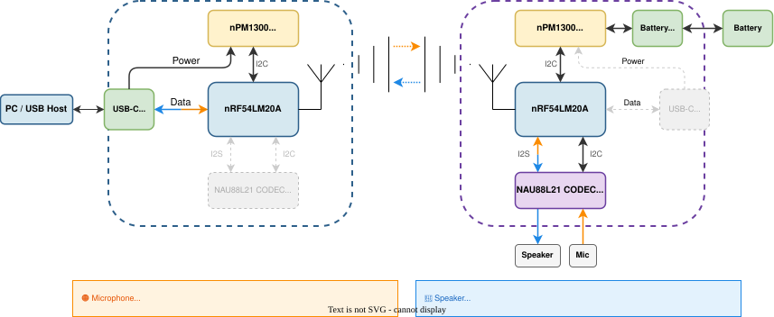

# FlexAudioLink

Low-latency wireless audio bridge.

## Motivation and Use-cases

originally built as a wireless transceiver for a gaming headset retrofit. The hardware can also support:

- Wireless audio relay (e.g. room-to-room)
- BLE audio bridging (phone/laptop as central to a FlexAudioLink node)
- Flexible audio paths such as USB-to-analog, USB-to-USB, analog-to-analog, and BLE bridges

Note: Most of these are not yet implemented; see [Project Status](#project-status).

## Features

- Audio bridge endpoints: USB Audio Class device, I2S/analog codec, BLE
- Low-latency wireless link between devices
- USB CDC CLI for device configuration
- Web UI (Svelte) with WebSerial and WebSocket-to-serial bridge
- Single hardware design: nRF54LM20A + NAU88L21 + nPM1300

## Architecture

The diagram below shows the typical dongle/headset setup: dongle on the left, headset on the right. Both run the same hardware and firmware.

USB handles audio on the dongle side, I2S/codec on the headset side.

## Project Status

**Implemented:**
- USB device (UAC + CDC)
- Configuration persistence
- USB CDC CLI
- PROP radio test mode
- Audio I2S / codec integration
- Wireless audio streaming (USB ↔ I2S)

**In progress:**
- Schematic
- Update Docs

**Planned:**
- PCB layout
- Arbitrary Source/Sink combinations
- Analog multiplexing
- Packet Loss Concealment
- BLE audio transport
- Web UI

**Under evaluation:**
- Adaptive Frequency Hopping
- Clear Channel Assessment

## Documentation

[**Full documentation**](https://gab-k.github.io/FlexAudioLink/). 

Key pages:

- [**Getting Started**](https://gab-k.github.io/FlexAudioLink/getting-started/) — toolchain setup, build, and flash instructions
- [**Firmware**](https://gab-k.github.io/FlexAudioLink/firmware/) — architecture, PROP protocol
- [**Hardware**](https://gab-k.github.io/FlexAudioLink/hardware/) — schematic, PCB, rationale for chosen components
- [**Web UI**](https://gab-k.github.io/FlexAudioLink/webui/) — setup and configuration
- [**CLI Reference**](https://gab-k.github.io/FlexAudioLink/cli/) — available CLI commands

Note: the documentation is a work in progress and nowhere near complete.

## Repository Layout

- `firmware/`: active Zephyr-based firmware for `nrf54lm20dk/nrf54lm20a/cpuapp`
- `webui/`: Svelte configuration UI plus Python WebSocket-to-serial bridge
- `hardware/`: KiCad project and hardware notes
- `python/`: standalone utilities for signal generation and latency/error experiments
- `devel_notes/`: bring-up and development references
