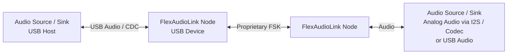
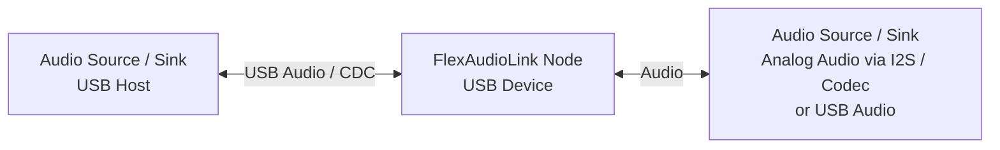
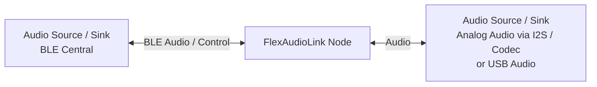

# FlexAudioLink

Low-latency wireless audio bridge.

## Scope

FlexAudioLink is intended to bridge audio and audio transport endpoints in the following combinations:

- USB Audio to analog audio
- USB Audio to USB Audio
- analog audio to analog audio
- BLE central device to analog audio
- BLE central device to USB Audio

The bridge may be configured for:

- duplex operation
- simplex operation

In this context:

- analog audio refers to the codec / analog I/O side of the system
- USB Audio refers to USB Audio Class device operation
- BLE central device refers to a host such as a phone or laptop acting as the central

All FlexAudioLink nodes use the same hardware and firmware base and are configured at runtime for the required operating mode.

## Repository Layout

- `firmware/`: active Zephyr-based firmware for `nrf54lm20dk/nrf54lm20a/cpuapp`
- `webui/`: Svelte configuration UI plus Python WebSocket-to-serial bridge
- `hardware/`: KiCad project and hardware notes for the nRF54LM20A + NAU88L21 + nPM1300 design
- `python/`: standalone utilities for signal generation and latency/error experiments
- `devel_notes/`: bring-up and development references

## Current Firmware State

Implementation is in `firmware/`, a Zephyr application for
`nrf54lm20dk/nrf54lm20a/cpuapp`.

Currently implemented:

- USB device bring-up with profile-selected descriptors (UAC+CDC or CDC-only)
- persisted boot profile selection between `usb`, `pfsk_dongle`, and `pfsk_headset`
- USB CDC CLI
- USB audio mode
- PFSK radio test mode, including TX/RX traffic and status counters
- initial audio I2S / codec integration scaffolding

Not implemented yet:

- end-to-end wireless audio streaming
- BLE audio transport
- full realization of the configuration surface described by the web UI specification

Important implementation notes:

- `firmware/src/main.c`: loads the persisted boot profile and starts that profile's audio path
- `firmware/src/app_control.c`: owns boot profile persistence and startup
- PFSK profiles currently enable the present radio test-mode path; they are not yet the final audio transport

## CLI Interface

The nRF firmware exposes a USB CDC CLI in `firmware/src/cli.c`.

Current commands include:

- `help`
- `get`
- `set profile <usb|pfsk_dongle|pfsk_headset>`
- `status`
- `status on [ms]`
- `status off`
- `scan`
- `linktest on|off|status`
- `i2s tone on|off|status`
- `reset`

The web UI uses this text interface.

## Hardware

`hardware/` currently contains early hardware notes and KiCad work-in-progress.

The current notes investigate a design based on:

- nRF54LM20A
- NAU88L21 audio codec
- nPM1300 PMIC

This part of the repository is exploratory and subject to change.

## Build Notes

For toolchain setup and build steps, see `firmware/README.md`.

## Web UI

`webui/` contains:

- a Svelte application in `webui/app/`
- a Python WebSocket-to-serial bridge in `webui/websocket_serial_bridge.py`

The UI communicates with the device over USB CDC ACM using:

- WebSerial in Chromium-based browsers
- a local WebSocket bridge for browsers without WebSerial support

`webui/spec.md` is broader than the currently implemented firmware surface and should be read as intent rather than as a statement of completed firmware behavior.

## Diagram Draft 1

## Diagram Draft 2

## Diagram Draft 3

