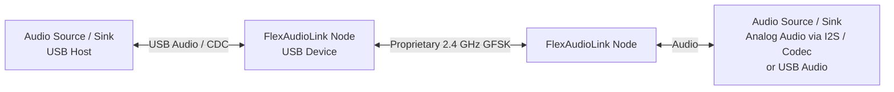
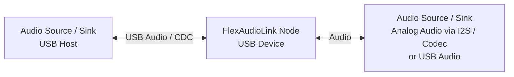
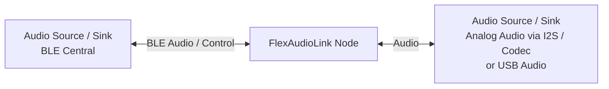

# FlexAudioLink

Low-latency wireless audio bridge.

## 1. Scope

FlexAudioLink is intended to bridge audio and audio transport endpoints in the following combinations:

- USB Audio to analog audio
- USB Audio to USB Audio
- analog audio to analog audio
- BLE central device to analog audio
- BLE central device to USB Audio

The bridge may be configured for:

- duplex operation
- simplex operation

In this context:

- analog audio refers to the codec / analog I/O side of the system
- USB Audio refers to USB Audio Class device operation
- BLE central device refers to a host such as a phone or laptop acting as the central

All FlexAudioLink nodes use the same hardware and firmware base and are configured at runtime for the required role and mode.

## 2. Repository Layout

- [`nrf_firmware/`](/home/gab/FlexAudioLink/nrf_firmware): active Zephyr-based firmware for `nrf54lm20dk/nrf54lm20a/cpuapp`
- [`rw612_firmware/`](/home/gab/FlexAudioLink/rw612_firmware): older MCUXpresso + FreeRTOS firmware retained as reference
- [`webui/`](/home/gab/FlexAudioLink/webui): Svelte configuration UI plus Python WebSocket-to-serial bridge
- [`hardware/`](/home/gab/FlexAudioLink/hardware): KiCad project and hardware notes for the nRF54LM20A + NAU88L21 + nPM1300 design
- [`python/`](/home/gab/FlexAudioLink/python): standalone utilities for signal generation and latency/error experiments
- [`devel_notes/`](/home/gab/FlexAudioLink/devel_notes): bring-up and development references

## 3. Current Firmware State

The active implementation is in [`nrf_firmware/`](/home/gab/FlexAudioLink/nrf_firmware).

The current firmware direction is based on the nRF54LM20A and a proprietary 2.4 GHz link. The older RW612 Wi-Fi firmware remains in the repository as reference material.

Implemented in the current nRF tree:

- USB device bring-up
- runtime USB profile switching between `CDC` and `UAC+CDC`
- runtime role selection: `dongle` or `headset`
- runtime mode selection: `proprietary`, `ble`, or `usb`
- default role selection from device UID
- USB CDC CLI
- proprietary radio link test, including TX/RX traffic and status counters
- initial audio I2S / codec integration scaffolding

Not complete in the current nRF tree:

- end-to-end wireless audio streaming
- BLE audio transport
- full realization of the configuration surface described by the web UI specification

Important implementation notes:

- [`nrf_firmware/src/main.c`](/home/gab/FlexAudioLink/nrf_firmware/src/main.c): `main()` is intentionally idle; subsystems self-start via `K_THREAD_DEFINE(...)`
- [`nrf_firmware/src/app_control.c`](/home/gab/FlexAudioLink/nrf_firmware/src/app_control.c): owns runtime role/mode state
- `dongle + usb` is rejected
- proprietary mode currently enables the present radio/link-test path; it is not yet the final audio transport

## 4. nRF Runtime Model

Runtime state is represented by:

- role: `dongle` or `headset`
- mode: `proprietary`, `ble`, or `usb`

Current mode application affects at least:

- USB profile selection in [`nrf_firmware/src/usb/usb_device.c`](/home/gab/FlexAudioLink/nrf_firmware/src/usb/usb_device.c)
- proprietary test-mode enable/disable in [`nrf_firmware/src/prop_gfsk/test_mode.c`](/home/gab/FlexAudioLink/nrf_firmware/src/prop_gfsk/test_mode.c)

The current proprietary radio test configuration is defined in [`nrf_firmware/src/prop_gfsk/radio_hw.h`](/home/gab/FlexAudioLink/nrf_firmware/src/prop_gfsk/radio_hw.h). At present this includes:

- fixed center frequency: `2480 MHz`
- fixed radio mode: Nordic `4 Mbit`
- fixed packet sizing for the present test path

## 5. CLI Interface

The nRF firmware exposes a USB CDC CLI in [`nrf_firmware/src/cli.c`](/home/gab/FlexAudioLink/nrf_firmware/src/cli.c).

Current commands include:

- `help`
- `get`
- `set role <dongle|headset>`
- `set mode <proprietary|ble|usb>`
- `status`
- `status on [ms]`
- `status off`
- `scan`
- `linktest on|off|status`
- `i2s tone on|off|status`
- `reset`

The web UI uses this text interface.

## 6. Hardware

[`hardware/`](/home/gab/FlexAudioLink/hardware) currently contains early hardware notes and KiCad work-in-progress.

The current notes investigate a design based on:

- nRF54LM20A
- NAU88L21 audio codec
- nPM1300 PMIC

This part of the repository is exploratory and subject to change.

See [`hardware/hw_spec.md`](/home/gab/FlexAudioLink/hardware/hw_spec.md).

## 7. Build Notes

For toolchain setup and build steps, see [`nrf_firmware/README.md`](/home/gab/FlexAudioLink/nrf_firmware/README.md).

## 8. Web UI

[`webui/`](/home/gab/FlexAudioLink/webui) contains:

- a Svelte application in `webui/app/`
- a Python WebSocket-to-serial bridge in [`webui/websocket_serial_bridge.py`](/home/gab/FlexAudioLink/webui/websocket_serial_bridge.py)

The UI communicates with the device over USB CDC ACM using:

- WebSerial in Chromium-based browsers
- a local WebSocket bridge for browsers without WebSerial support

`webui/spec.md` is broader than the currently implemented firmware surface and should be read as intent rather than as a statement of completed firmware behavior.

## 9. Notes

- The root README is intended as a current repository summary. It is not a complete design document.
- [`nrf_firmware/tinyusb/`](/home/gab/FlexAudioLink/nrf_firmware/tinyusb) is a git submodule.
- Build outputs are checked into parts of the repository. Do not assume the working tree is clean.
- Repository contents and implementation details are subject to change.

## Diagram Draft 1

## Diagram Draft 2

## Diagram Draft 3

