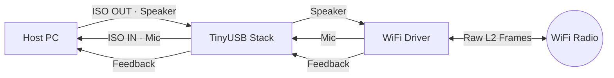
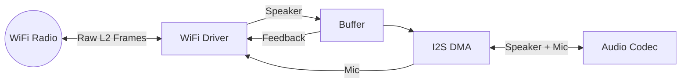
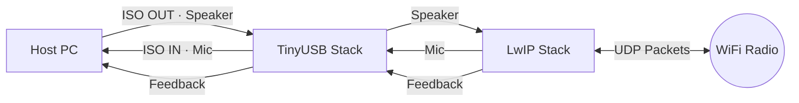
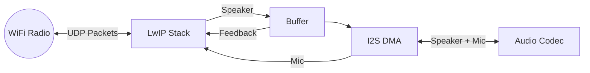

# FlexAudioLink

FlexAudioLink is a standalone, low-latency wireless audio bridge that supports one-to-one or one-to-many streaming.

The project uses custom hardware based on the NXP RW612 (Dual-band Wi-Fi 6 & BLE 5.4 MCU) running FreeRTOS firmware. The same hardware can be configured for different operational modes at runtime.

## Status Legend:
✅ Implemented
🚧 Work in Progress
🔮 Planned

## Key Features

- USB Audio Class 2.0 compliant, works as a standard audio device ✅
- Runtime mode switching via CLI (Virtual Com Port) ✅
- Low-latency wireless audio streaming over Wi-Fi 🚧
- Adaptive buffer sizing based on network conditions 🔮
- Low-power wireless audio streaming over BLE 🔮
- Streaming via IP network 🔮
- Point-to-multipoint support, one dongle, multiple speakers/headsets 🔮

## Operational Modes (Runtime Configurable):

### 1. USB-to-I2S Bridge (USB Headset Mode) ✅
Acts as a standard USB Audio Class 2.0 device. Isochronous USB data is routed directly to/from the I2S interface via DMA.

**Use case**: Wired fallback for wireless headsets when battery is depleted.

    
### 2. USB-to-WiFi Bridge (Raw L2 Dongle Mode) 🚧

Full-duplex USB audio interface that wirelessly bridges to headset hardware using raw 802.11 L2 frames, bypassing the IP/UDP stack entirely for minimum transport latency.

- Playback path: Receives playback (speaker) audio from the USB host, packs samples directly into raw L2 frames, and injects them into the WiFi driver without any IP/UDP processing overhead.

- Microphone path: Receives microphone audio from the headset via raw L2 frames and forwards it to the USB audio IN endpoint.

- Feedback path: Receives speaker buffer fill level feedback from the headset via raw frames and applies it to the USB isochronous feedback endpoint to compensate for clock drift.

### 3. WiFi-to-I2S Bridge (Raw L2 Headset Mode) 🚧

Wireless audio endpoint that receives raw 802.11 L2 frames directly from the WiFi driver via a netif hook, bypassing the IP/UDP stack for minimum transport latency.

- Playback path: Intercepts incoming raw frames before the LwIP network stack, buffers them in the speaker buffer, and outputs audio via I2S to a CODEC.

- Microphone path: Captures microphone audio via I2S CODEC, packs samples into raw Ethernet frames, and transmits them back to the dongle over WiFi without buffering.

- Feedback path: Transmits speaker buffer fill level back to the dongle via raw frames to compensate for clock drift.

### 4. USB-to-WiFi Bridge (UDP Dongle Mode) 🚧

Full-duplex USB audio interface that wirelessly bridges to headset hardware over UDP/IP via the LwIP stack.

- Playback path: Receives playback (speaker) audio from the USB host, packetizes samples into UDP frames, and transmits them over WiFi.

- Microphone path: Receives microphone audio from the headset via UDP and forwards it to the USB audio IN endpoint.

- Feedback path: Receives speaker buffer fill level feedback from the headset and applies it to the USB isochronous feedback endpoint to compensate for clock drift.

### 5. WiFi-to-I2S Bridge (UDP Headset Mode) 🚧

Wireless audio endpoint with direct audio hardware interfacing.

- Playback path: Receives UDP audio data from the dongle, buffers it in the speaker buffer, and outputs audio via I2S to a CODEC.

- Microphone path: Captures microphone audio via I2S CODEC, packetizes samples into UDP frames, and transmits them back to the dongle over WiFi without buffering.

- Feedback path: Transmits speaker buffer fill level back to the dongle to compensate for clock drift.

### 6. BLE Headset Mode 🔮

Operates as a Bluetooth Low Energy audio headset, removing the need for WiFi in portable or low-power scenarios.
Targets lower power consumption and broader device compatibility, with higher latency than WiFi modes.

### 7. Network Audio Endpoint Mode 🔮

Connects to a local network as a standalone audio endpoint, enabling:

- Direct audio streaming from any device on the same network

- Optional internet streaming 

- Operation without a dedicated dongle
