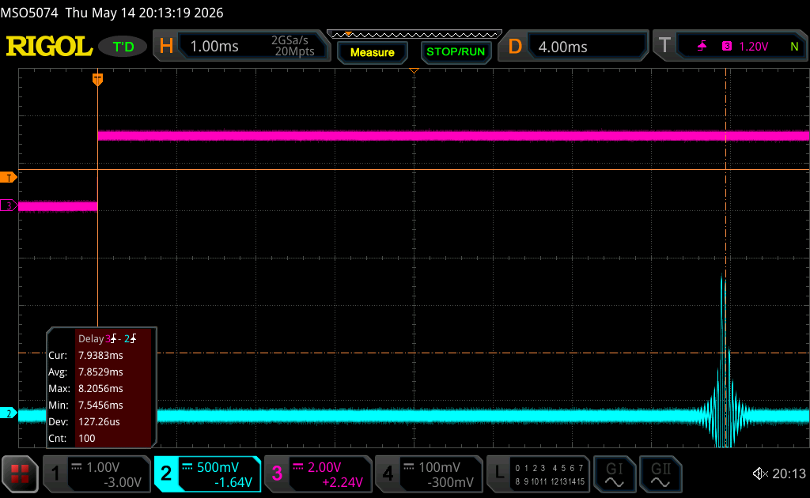

# Latency Measurement

Measurement used to characterize the device latency of the PROP audio
path. The measured path starts when the dongle firmware recognizes a marker in a
USB speaker packet and ends when the corresponding marker appears at the headset
codec analog output.

## Measurement Principle

USB host plays a 48 kHz, stereo, signed 16-bit PCM WAV containing full-scale marker samples.

On the dongle, `path_dongle.c` scans each `PROP_SPK_PACKET_BYTES` speaker chunk
after it has been read from TinyUSB's EP OUT FIFO. When the marker pattern is
found, the dongle toggles GPIO P0.02. This GPIO edge is the measurement start
time.

The same marker samples are then transmitted to the headset over PROP and played
through the codec. The resulting analog pulse at the codec output is the
measurement stop time. The oscilloscope measures the time delta between the
dongle GPIO edge and the analog output pulse.

## Marker Format

Marker stimulus:

```text
Sample rate: 48 kHz
Channels:    2
Format:      signed 16-bit little-endian PCM
File:        python/latency_marker_48k_stereo.wav
Generator:   python/generate_latency_marker_wav.py
```

Marker sample sequence:

```text
+32767, +32767
-32768, -32768
+32767, +32767
-32768, -32768
```

The marker interval is aligned to the 1 ms speaker packet boundary. This keeps
the marker pattern inside a packet-sized chunk and allows deterministic marker
detection in `path_dongle.c`.

For the recorded measurement, the WAV was played from the USB host through a
direct ALSA hardware PCM device. This avoids host-side mixer gain, resampling,
or effects that could modify the full-scale marker samples.

## Measured Boundary

Measured interval:

```text
dongle P0.02 marker GPIO edge -> headset codec analog output pulse
```

The measured interval includes:

- dongle processing after the speaker packet has been read from TinyUSB EP OUT
- PROP TX enqueue and radio transfer
- headset PROP RX handling
- headset speaker FIFO buffering
- headset I2S scheduling and DMA
- codec output latency

## Probe Points

| Scope channel | Signal | Function |
|---|---|---|
| CH3 | Dongle P0.02 | Marker detection edge, measurement start |
| CH2 | Headset codec analog output | Reconstructed marker pulse, measurement stop |

P0.02 is used for the audio latency marker.

## Result



Capture file:

```text
docs/RigolDS9.png
```

Oscilloscope measurement:

```text
Rigol Delta 3->2
CH3 marker edge to CH2 analog pulse
100 marker events
```

Recorded statistics:

| Statistic | Latency |
|---|---:|
| Average | 7.8529 ms |
| Minimum | 7.5456 ms |
| Maximum | 8.2056 ms |
| Standard deviation | 127.26 us |


## Limitations

The measured interval excludes:

- application/media-player latency on the USB host
- host OS audio stack latency
- USB host scheduling before the packet reaches dongle firmware
- time spent queued in TinyUSB's EP OUT FIFO before `path_dongle.c` drains it

This is therefore not an end-to-end PC playback latency measurement. It is a
device-path latency measurement referenced to the point where dongle firmware
has already consumed the USB speaker packet containing the marker.
